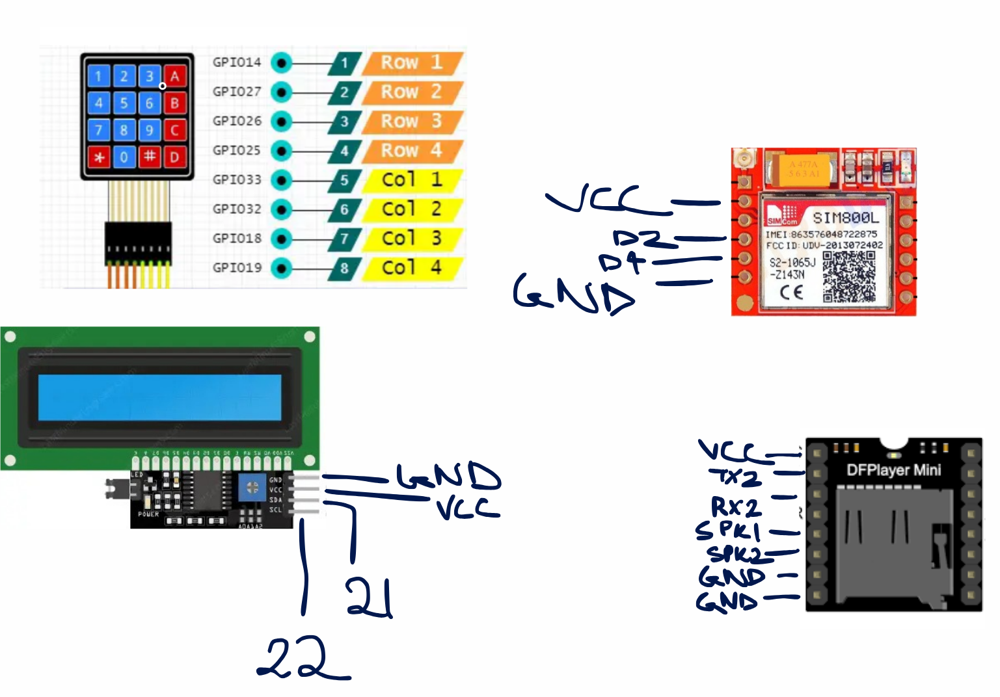
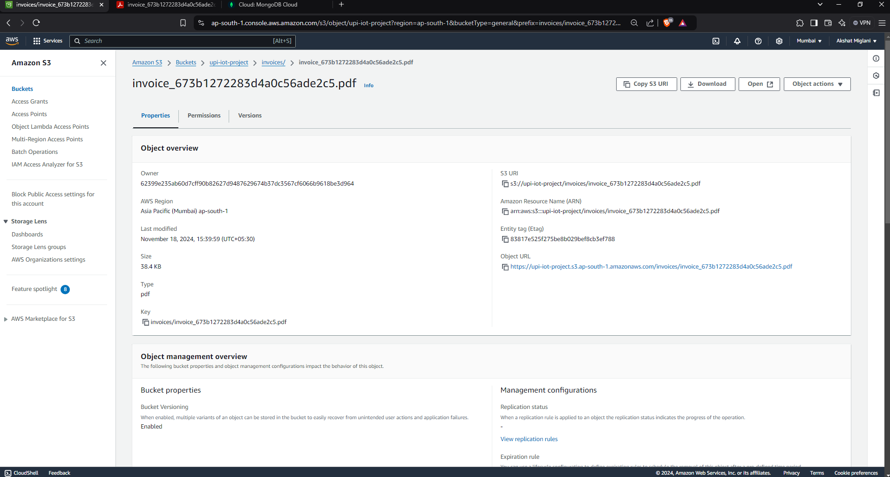
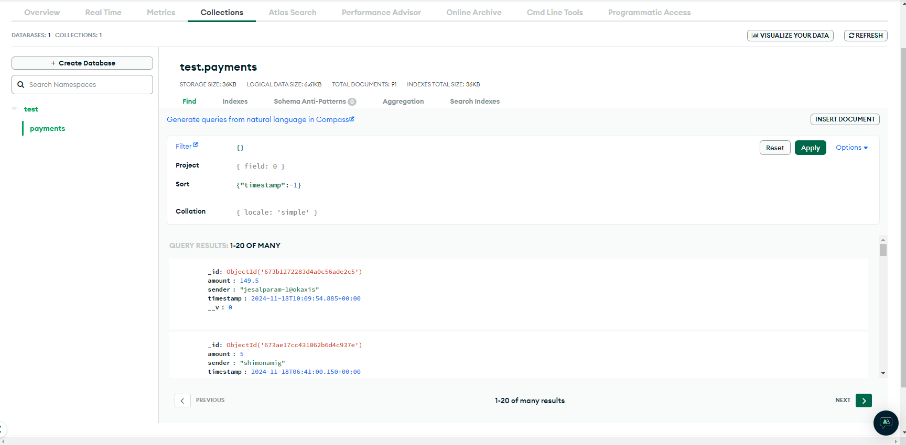
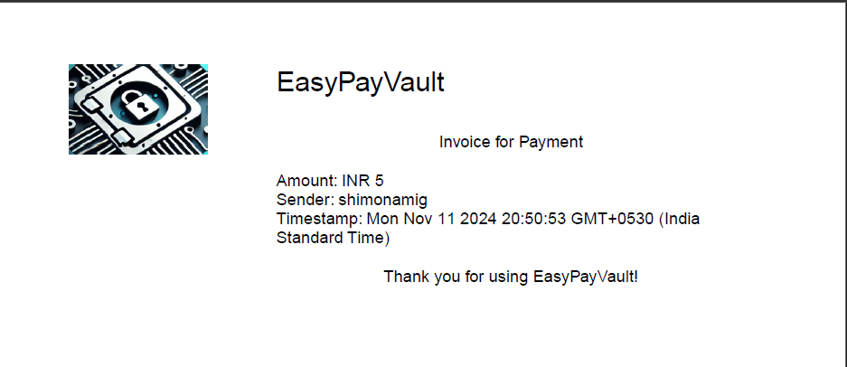

# UPI PAYMENT BOX

## Introduction
The UPI Payment Box project aims to create a device that records and notifies merchants/vendors/shopkeepers of UPI payments made to them in real time. This device provides sound notifications, receipt generation, and optional SMS receipt services for customer convenience.

Features:

1) Sound Notification: Alerts the merchant of received payments via a sound cue.

2) Automatic Receipt Generation: Saves the receipt to an S3 bucket for secure and remote storage.

3) SMS Receipt Option: Sends an SMS to the customer if they request a receipt.

## Components Used:

1) ESP32
2) DF Player Mini / MP3-TF-16P
3) SIM800L
4) LCD I2C 16X2
5) Keypad 4x4
6) 3W Speaker
7) Breadboard
8) Jumper Wires
9) Breadboard

## Conncetion diagram

The wiring may vary based on the specific model of the DF Player Mini / MP3-TF-16P

## S3 Bucket Invoice:

## Database Entry

## Sample Invoice

